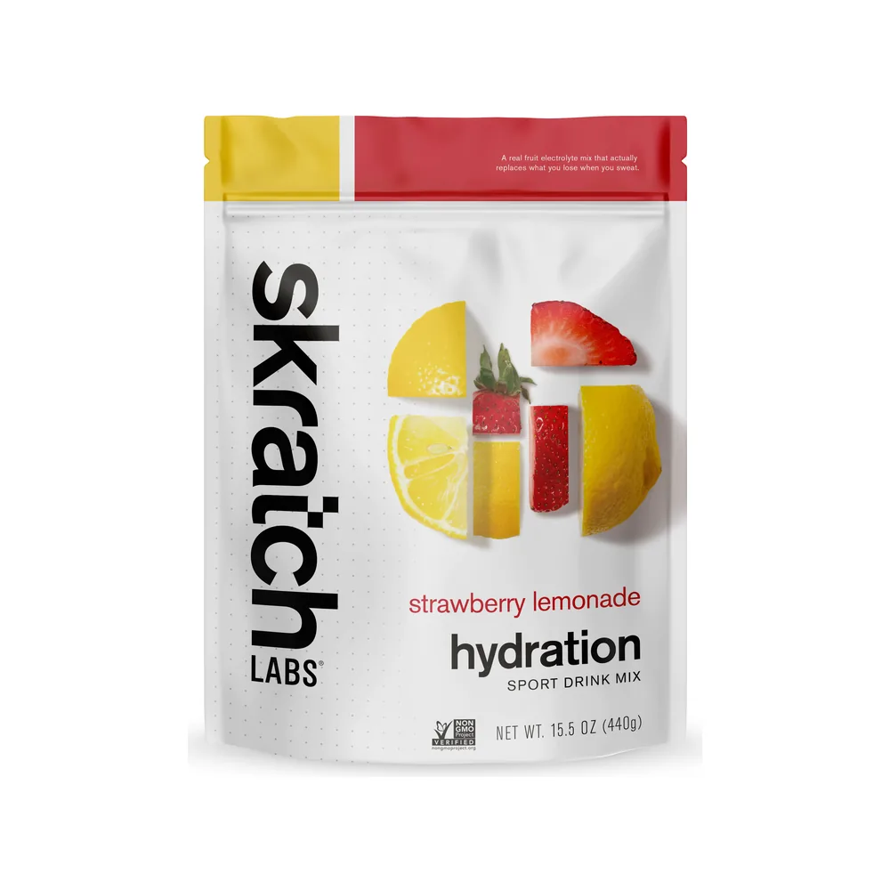

# Spec: Nuevos banners del carrusel del inicio

> Estado: **APROBADA** (2026-10-03). Maqueta aprobada con animación de entrada; el carrusel se queda en 3,5 s.
> Fecha: 2026-10-03.

## Objetivo

Reemplazar los banners del carrusel del inicio por un máximo de 3, elegidos con datos
reales, y empezar a medir cuál funciona.

**Por qué importa:** el carrusel es la parte más vista de la tienda.

| Dato (GA4, últimos 30 días) | Valor |
|---|---|
| Visitas que entran por el inicio | 2.455 de 2.827 (**87%**) |
| Visitas desde celular | 2.536 (**90%**) |
| Visitas desde anuncios de Instagram (`ig / paid`) | 1.698 (**60%**), con 14% de interacción |
| Clics en banners medidos hoy | **ninguno** — no hay evento para eso |

**Ventas reales** (hoja "Apex Nutrición" → VENTA, 14–30 sep 2026):

| Producto | Venta aprox. |
|---|---|
| Hidratante Going (tarro 300 g + sobres) | ~$339 (≈60%) |
| Geles Going | ~$74 |
| Proteína Going | ~$74 |
| Gomas Probar | ~$30 |
| Barras Going | ~$25 |
| SaltStick + Skratch + Honey Stinger | ~$19 |

**Banners actuales y qué pasa con ellos:**
- "Prepara tu kit para Caracas Rock" → **se elimina** (el evento ya pasó).
- "Cápsulas SaltStick" → **se elimina**: 16 vistas, 1 agregado al carrito y 0 ventas en 30 días.

## Los banners

| # | Contenido | Lleva a | Estado |
|---|---|---|---|
| 1 | **10% de descuento en tu primera compra** con el código `APEX2026` + **envío gratis desde $30 en Caracas**, mostrando las **dos presentaciones de hidratación Skratch Labs**: sobres y bolsa de 440 g | Dos botones: `producto-skratch.html` (sobres, **principal**) y `producto-skratch-bolsa.html` (bolsa, secundario) | **Aprobado** |
| 2 | **Hidratante Going** — el producto más vendido (60% de la venta). Sobres desde $1,79, caja x24 a $1,61 c/u | `producto-going-hidratante.html` | **Aprobado** |
| 3 | **Geles Going** — el producto más visto (54 vistas) y más agregado al carrito (38) de la tienda. Desde $3,44, arma tu caja surtida | `producto.html` | **Aprobado** |

Textos exactos del cupón (tomados del código, no inventados):
- Código `APEX2026`, 10% de descuento, **solo en la primera compra**. Se verifica con nombre y teléfono contra pedidos anteriores (`app.js`, `WELCOME_COUPON_*`).
- Se aplica en el carrito; el descuento no afecta el umbral de envío gratis desde $30.
- Envío gratis: **solo en Caracas** (Distrito Capital y zonas de Miranda reconocidas como Caracas), con subtotal ≥ $30 antes del descuento (`FREE_SHIPPING_AT`). Fuera de Caracas el envío es por MRW y se coordina. El banner debe decir "en Caracas".
- Con la bolsa de 440 g ($35,55) una sola unidad ya califica: $35,55 − 10% = $32,00, con envío gratis en Caracas.
- Sobres: $3,45 c/u (caja x12 a $3,17 c/u = $38,04, que también califica).

## Diseño (los diseño yo)

**Banners hechos en HTML/CSS con foto de producto, no imágenes con texto dentro.**
Hoy los banners son una imagen grande con el texto "pintado". Los nuevos serán:
- **Texto real** (título en Anton, texto en Inter, código del cupón en Space Mono): se lee nítido en cualquier pantalla, lo leen los lectores de pantalla y Google, y se puede cambiar un precio o un texto sin rehacer la imagen.
- **Una sola foto de producto** por banner (las WebP que ya existen en `assets/`), en lugar de un banner de 600–800 KB.
- **Siguen `DESIGN.md`:** blanco cálido, tinta, esquinas rectas de 2px, un solo acento coral; cada banner puede usar el color de su marca solo como detalle (Skratch #8C6B35, Going #3F7D5C).
- **Celular primero:** se diseñan para 375–393 px de ancho y luego se adaptan a escritorio (dos columnas: texto a la izquierda, producto a la derecha).
- **Mismo alto en los 3 banners** para que la página no salte al cambiar de diapositiva.
- **Un solo botón por banner** (por ejemplo "Ver hidratantes"), de 44 px de alto. **Excepción: el banner 1 tiene dos**, uno por presentación de Skratch (sobres = principal, bolsa = secundario), porque cada uno lleva a un producto distinto.

Antes de programar te muestro una **maqueta de los 3 banners** (celular y escritorio) para que la apruebes. **Aprobada** (`tasks/maqueta-carrusel.html`).

**Animación de entrada (aprobada, inspirada en The Feed):** al activarse cada banner, sus productos caen uno tras otro (120 ms de diferencia, 700 ms cada uno, con leve rebote) y quedan inclinados entre −7° y +8°. Solo `transform`/`opacity`; sin animación con "reducir movimiento". The Feed usa videos de 6–8 s; aquí es CSS sobre las mismas fotos, sin peso extra.

**Velocidad del carrusel: se mantiene en 3,5 s por banner** (se evaluó 4,5 s y se descartó); quedan ~2,5 s de lectura después de la entrada.

**Fotos:** recortes al contorno de las fotos existentes, en `assets/banners/` (14–22 KB c/u).

## Medición (nuevo)

Agregar los eventos estándar de GA4 para promociones:
- `view_promotion` cuando un banner se muestra (una vez por banner por visita).
- `select_promotion` cuando alguien toca el banner o su botón. En el banner 1, el parámetro `creative_name` indica cuál botón (`bolsa` o `sobres`).
- Parámetros: `promotion_id` (`bienvenida-skratch`, `hidratante-going`, `geles-going`), `promotion_name`, `creative_slot` (`hero-1`…`hero-3`).

Así, en 2 semanas se podrá ver qué banner genera más clics (`promotion_clicks / promotion_views`), con el mismo conector de Windsor.ai que usa el reporte semanal.

## Tech Stack

Sitio estático (HTML + `styles.css` + `app.js`, sin paso de compilación), servido por Cloudflare Workers. El carrusel existente (`initHeroCarousel` en `app.js`) se mantiene: autoplay de 3,5 s, botón de pausa, puntos, flechas y respeto a "movimiento reducido".

## Commands

```bash
npm run check:fast            # secretos, antes de cada commit
npm run check:task            # Lighthouse móvil de las páginas cambiadas
node scripts/check-performance.mjs index.html   # solo el inicio
python3 -m http.server 8934   # servidor local (o la vista previa "tienda-marca")
```

## Project Structure

| Archivo | Cambio |
|---|---|
| `index.html` | Reemplazar las 2 diapositivas actuales por las 3 nuevas |
| `styles.css` | Estilos de las diapositivas nuevas; quitar los de `--kit-banner` y `--capsulas-banner` (y los restos sin uso `--skratch-banner`, `--fastchews-banner`) |
| `app.js` | Eventos `view_promotion` / `select_promotion` en `initHeroCarousel` |
| `assets/` | Solo fotos WebP existentes; las imágenes de los banners viejos se quedan en el servidor |
| `DESIGN.md` | Documentar el patrón nuevo de banner |

## Code Style

Igual que el resto del sitio: HTML semántico, clases BEM-ish (`hero-slide--bienvenida`), variables de `styles.css`, JS ES5-compatible con comentarios en español. Ejemplo de la estructura de una diapositiva:

```html
<div class="hero-slide hero-slide--bienvenida" data-promo-id="bienvenida-skratch"
     data-promo-name="10% bienvenida — Skratch" data-promo-slot="hero-1">
  <div class="container">
    <div class="hero-copy">
      <p class="eyebrow">Primera compra</p>
      <h2 class="h-46">10% de descuento</h2>
      <p>Usa el código <span class="hero-code">APEX2026</span> en el carrito.</p>
      <a class="btn btn--primary" href="producto-skratch-bolsa.html">Ver hidratante Skratch</a>
    </div>
    
  </div>
</div>
```

## Testing Strategy

No hay framework de pruebas en el repo; se verifica con:
- **Playwright CLI** (iPhone 15 y escritorio 1280 px): las 3 diapositivas se muestran, avanzan solas, la pausa funciona, cada botón lleva a la página correcta y se disparan `view_promotion` y `select_promotion` con los parámetros correctos (revisando `dataLayer`).
- **Lighthouse** (`check-performance.mjs`) sobre `index.html` contra los pisos de `CONSTRAINTS.md`.
- **Capturas** de las 3 diapositivas en celular y escritorio para tu revisión final.

## Boundaries

- **Siempre:** seguir `DESIGN.md`; texto real (no imágenes con texto); medir antes y después con Lighthouse; `npm run check:fast` antes de cada commit; mostrar maqueta antes de programar.
- **Preguntar antes:** cambiar el cupón, sus condiciones o su código; agregar un 4º banner; cambiar la velocidad del carrusel; usar fotos que no estén ya en `assets/`.
- **Nunca:** subir sin tu "Sube todo"; prometer descuentos o condiciones que el carrito no aplique; borrar las imágenes de los banners viejos del servidor; tocar el bloqueo de zoom (excepción de `CONSTRAINTS.md`).

## Success Criteria

1. El carrusel del inicio tiene **exactamente 3 banners**, en este orden: 10% bienvenida (Skratch), Hidratante Going, Geles Going. Caracas Rock y Cápsulas SaltStick ya no aparecen.
2. Todo el texto de los banners es **texto real**, con contraste ≥ 4.5:1, y cada botón mide ≥ 44 px de alto.
3. El banner 1 dice exactamente las condiciones reales: 10%, solo primera compra, código `APEX2026`, y envío gratis desde $30 **en Caracas**.
4. Los 3 banners tienen **el mismo alto** y la página no salta al cambiar (CLS del inicio ≤ 0,015, como hoy).
5. Lighthouse del inicio: rendimiento ≥ 82 y accesibilidad ≥ 93 (los valores de hoy).
6. En celular (393 px) el título y el botón del banner se ven **sin hacer scroll**.
7. `view_promotion` se dispara una vez por banner visto y `select_promotion` en cada clic, con `promotion_id`, `promotion_name` y `creative_slot`; verificado en `dataLayer` con Playwright.
8. Carrusel: autoplay de **3,5 s** (sin cambios), pausa, puntos, flechas y movimiento reducido funcionando.
9. Los productos de cada banner entran uno tras otro al activarse el banner, y no se animan con "reducir movimiento".

## Decisiones tomadas (antes "Open Questions")

1. Banners 2 y 3 (Hidratante Going, Geles Going): **aprobados**.
2. Banner 1 muestra **las dos presentaciones** con un botón para cada una; **los sobres son lo principal** (foto destacada y botón principal), la bolsa de 440 g va como secundaria.
3. Skratch se **mantiene** en el banner 1 pese a sus ventas bajas: decisión de marca. La medición de promociones dirá en 2 semanas si el banner lo mueve.
4. Banner 1 agrega **"Envío gratis desde $30 en Caracas"** (con "en Caracas", porque así funciona el carrito).
